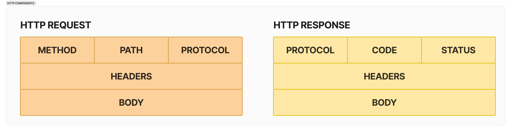
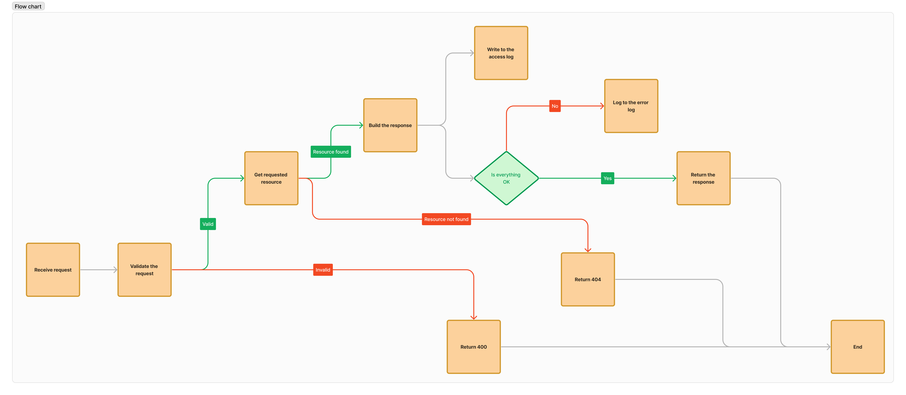

# Rust Web Server

This is a simple web server written in Rust. The project provides fundamental HTTP server functionality and is designed for minimal setup and configuration.

**Disclaimer:** This project is built for educational purposes and is not ready for production use.

## Features

- **Minimalist Implementation:** Built without external dependencies, focusing on core HTTP server functionality.
- **Easy Setup:** Simple to clone, build, execute and collaborate on.
- **Customizable:** Easily configurable to suit various needs, such as adjusting port settings, specifying routing rules, and modifying logging behavior.
- **Concurrency:** Takes advantage of Rust's multi-threading capabilities to process multiple requests simultaneously.
- **Logging:** Provides basic logging functionality to track server activity.

## Usage

- Clone the Repository
- Modify the server configuration in the `server/config.toml` file to customize the server settings.
- Build the Project: `cargo build`
- Run the Server: `cargo run`
- Open a web browser and visit `http://localhost:7878` to interact with the server.

You can update HTML files in the `public` directory to customize the server's response.

## Hypertext Transfer Protocol (HTTP)

HTTP (Hypertext Transfer Protocol) is the foundation of data communication on the World Wide Web. It is a protocol that defines how messages are formatted and transmitted, and how web servers and browsers should respond to various commands.

HTTP requests and responses follow a specific structure that allows clients and servers to communicate effectively:

## Request Lifecycle

When a new request is received through the exposed port, the server first validates the raw components of the request and then parses it into a structured format (including HTTP method, headers, and body).

Once parsed, the server locates the requested resource based on the URI. Finally, after processing the request and generating a response, the server logs information to its access log, which can be used for monitoring, debugging, and analysis purposes.

## Contrubutions

Contributions are welcome! Feel free to submit issues, feature requests, or pull requests to help improve this project.

## License

This project is licensed under the MIT License. See the `LICENSE` file for more information.
